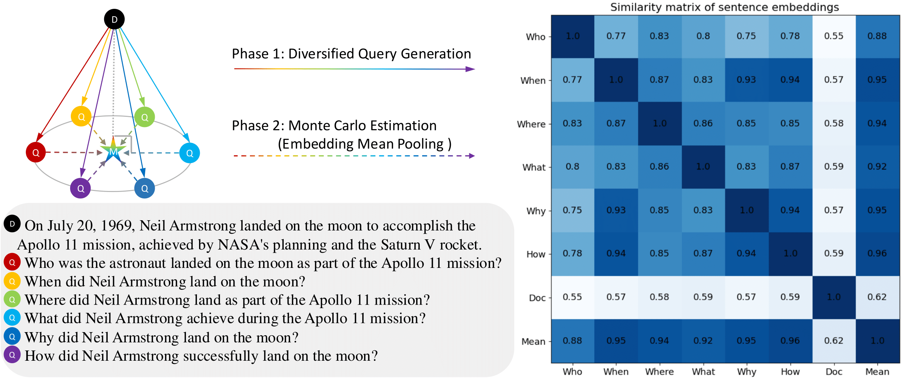
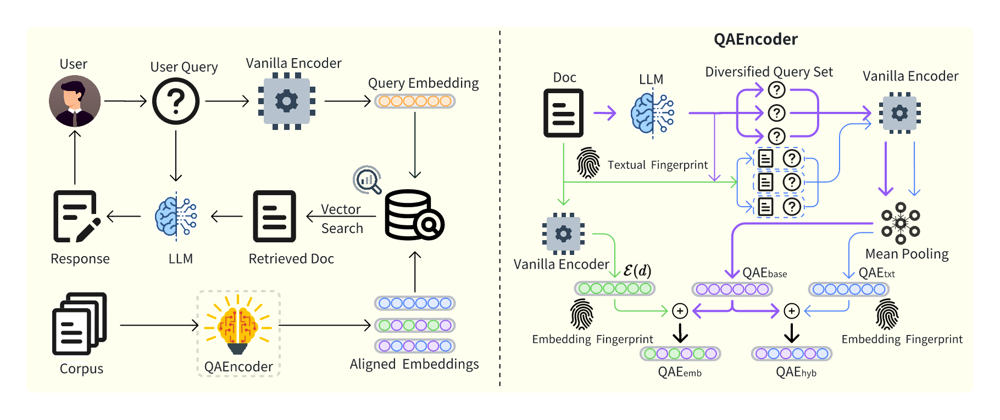
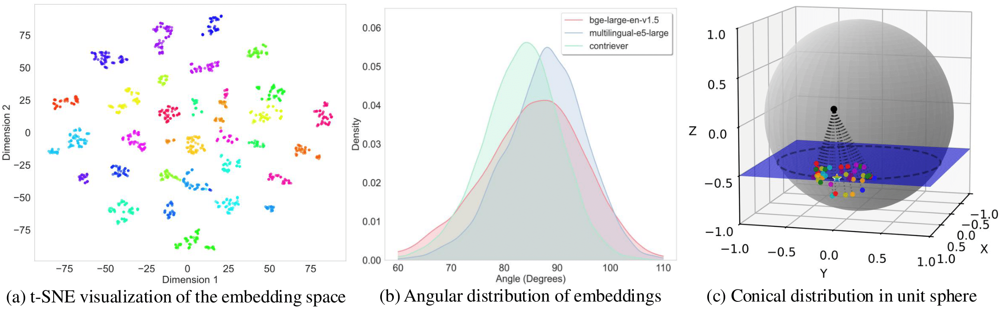
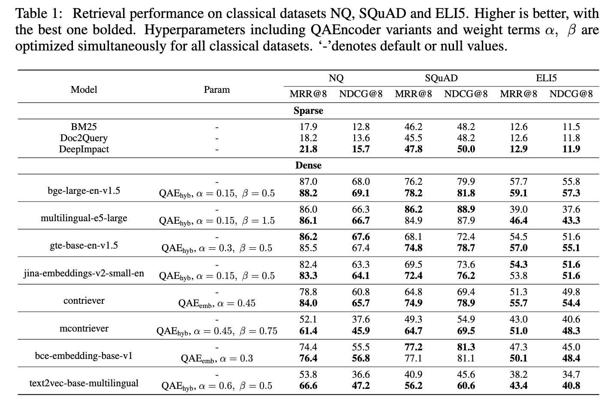
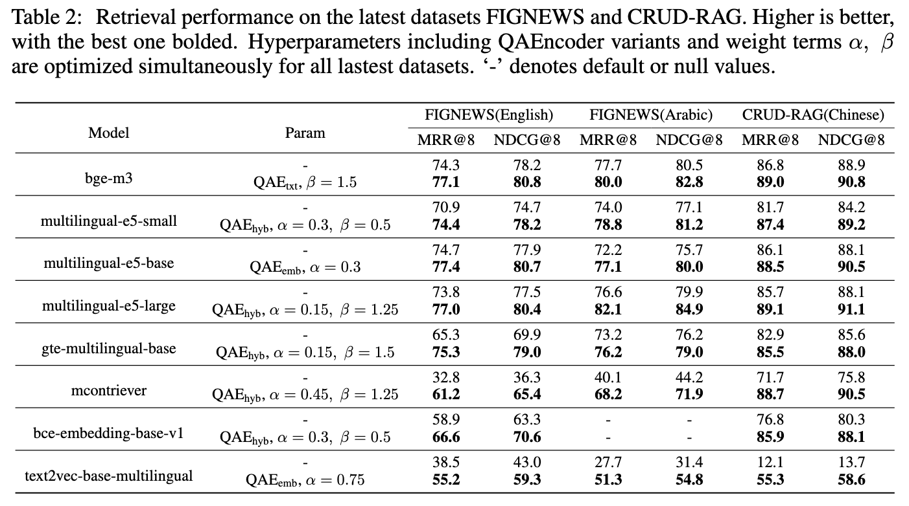
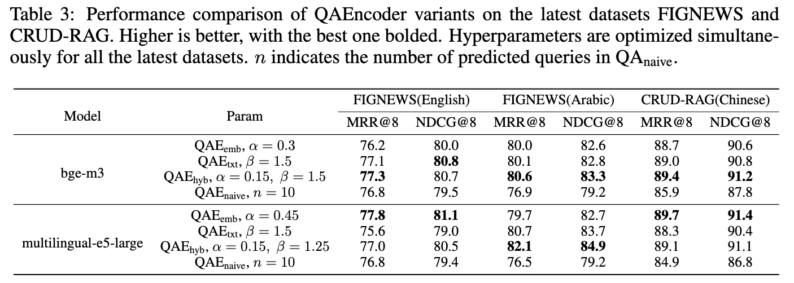
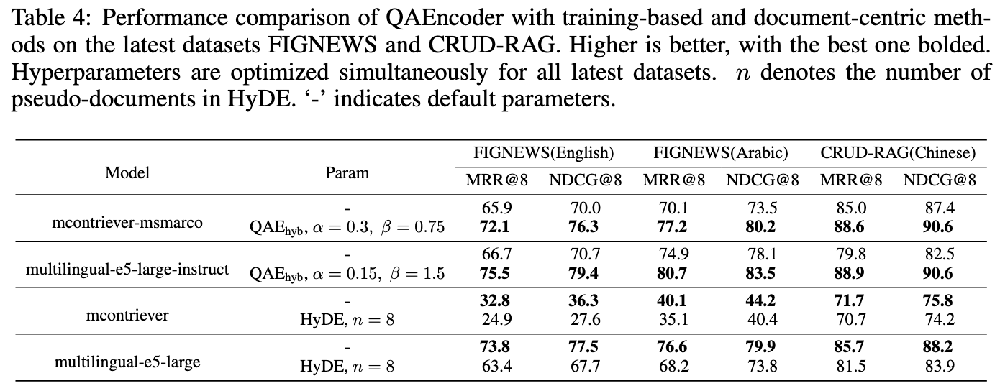
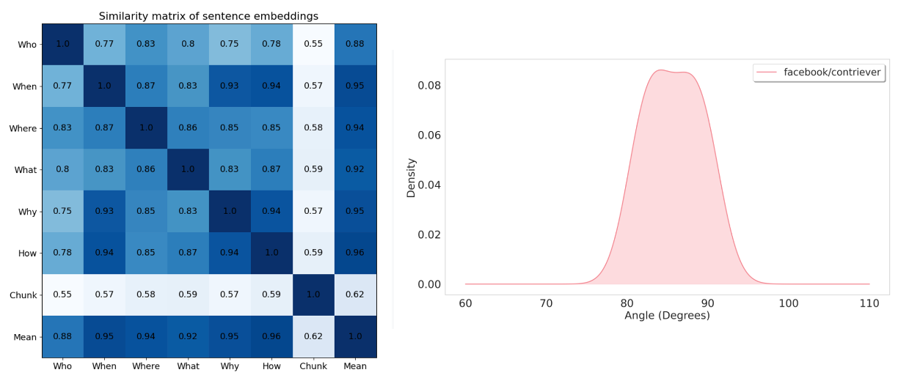

# QAEncoder: Towards Aligned Representation Learning in Question Answering System

 <a href='https://arxiv.org/abs/2409.20434'></a> &nbsp;&nbsp;&nbsp;&nbsp;&nbsp;

Official implementation of our [QAEncoder](https://arxiv.org/abs/2409.20434) method for more advanced QA systems.

## Introduction
Modern QA systems entail retrieval-augmented generation (RAG) for accurate and trustworthy responses. However, the inherent gap between user queries and relevant documents hinders precise matching. Motivated by our conical distribution hypothesis, which posits that potential queries and documents form a cone-like structure in the embedding space, we introduce **QAEncoder**, a **training-free** approach to bridge this gap. Specifically, QAEncoder estimates the expectation of potential queries in the embedding space as a robust surrogate for the document embedding, and attaches document fingerprints to effectively distinguish these embeddings. Extensive experiments on **fourteen embedding models across six languages and eight datasets** validate QAEncoder's alignment capability, which offers a plug-and-play solution that **seamlessly integrates with existing RAG architectures and training-based methods**.

<table class="center">
    <tr>
        <td width=100% style="border: none"></td>
    </tr>
    <tr>
        <td width="100%" style="border: none; text-align: center; word-wrap: break-word">
              Illustration of QAEncoder's alignment process: Solid lines represent diversified query generation, while dashed lines indicate Monte Carlo estimation. The heatmap depicts the similarity scores among the embeddings of the different queries, the document, and the mean estimation.
      </td>
    </tr>
</table>

<table class="center">
    <tr>
        <td width=100% style="border: none"></td>
    </tr>
    <tr>
        <td width="100%" style="border: none; text-align: center; word-wrap: break-word">
      Architecture of  QAEncoder.   Left: Corpus documents are embedded using QAEncoder to obtain query-aligned representations for indexing.   User queries are encoded with a vanilla encoder and used to retrieve relevant documents.    
    Right: Internal mechanism of QAEncoder.
    QAEncoder  addresses the document-query gap by generating a diverse set of queries for each document to create semantically aligned embeddings.
    Additionally, document fingerprint strategies are employed to ensure document distinguishability.
      </td>
    </tr>
</table>
<table class="center">
    <tr>
        <td width=100% style="border: none"></td>
    </tr>
    <tr>
        <td width="100%" style="border: none; text-align: center; word-wrap: break-word">
Conical distribution hypothesis validation.
    The figure presents three visualizations supporting the conical distribution hypothesis: 
    (a) t-SNE visualization of queries derived from various documents in the embedding space, illustrating distinct clustering behavior.
    (b) Angular distribution of document and query embeddings, showing the distribution of angles between $ v_d = \mathcal{E}(d) - \mathbb{E}[\mathcal{E}(\mathcal{Q}(d))] $ and $ v_{q_i} = \mathcal{E}(q_i) - \mathbb{E}[\mathcal{E}(\mathcal{Q}(d))] $. 
    The angles form a bell curve just below 90°, supporting that $ v_d $ is approximately orthogonal to each $ v_{q_i}$ and serves as the normal vector.
    (c) 3D visualization illustrating the conical distribution of the document (black point) and query (colored points) embeddings  within a unit sphere. 
    The star indicates the queries' cluster center.
      </td>
    </tr>
</table>


## Experiments
### Experiments On Classical Datasets

### Experiments On Latest Datasets

### Ablation Studies

### Training-based and Document-centric Methods


## Quick Start

Set up the environment and run the demo script:

```bash
git clone https://github.com/IAAR-Shanghai/QAEncoder.git
cd QAEncoder
conda create -n QAE python==3.8
pip install -r requirements-demo.txt
python demo.py
```

Results should be like:




<!-- ## 🚩 New Updates  -->
<!-- **⭐⭐⭐New Features⭐⭐⭐** -->

## TODO
This work is currently under review and code refactoring. We plan to fully open-source our project in order.
- [x] Release Demo
- [ ] Release QAEncoder codes and datasets
- [ ] Release QAEncoder codes compatible with Llamaindex and Langchain
- [ ] Release QAEncoder++, our future works


## 📖 BibTeX

```
@article{wang2024qaencoder,
    title={QAEncoder: Towards Aligned Representation Learning in Question Answering System}, 
    author={Wang, Zhengren and Yu, Qinhan and Wei, Shida and Li, Zhiyu and Xiong, Feiyu and Wang, Xiaoxing and Niu, Simin and Liang, Hao and Zhang, Wentao}
    journal={arXiv preprint arXiv:2409.20434},
    year={2024}
}
```
