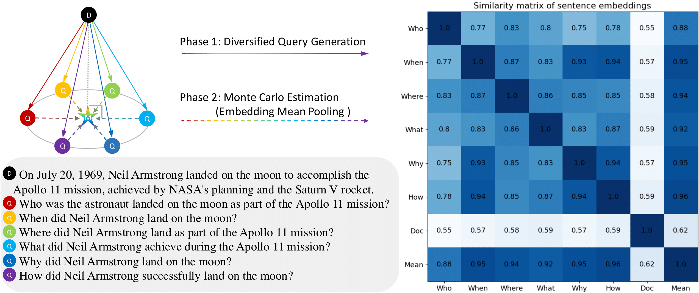
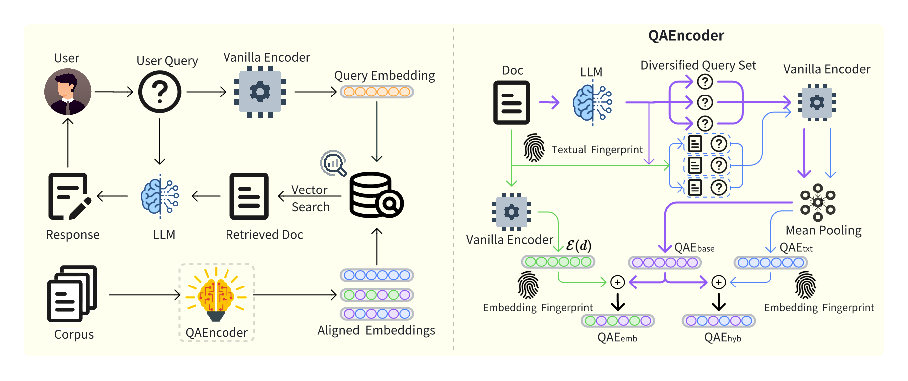
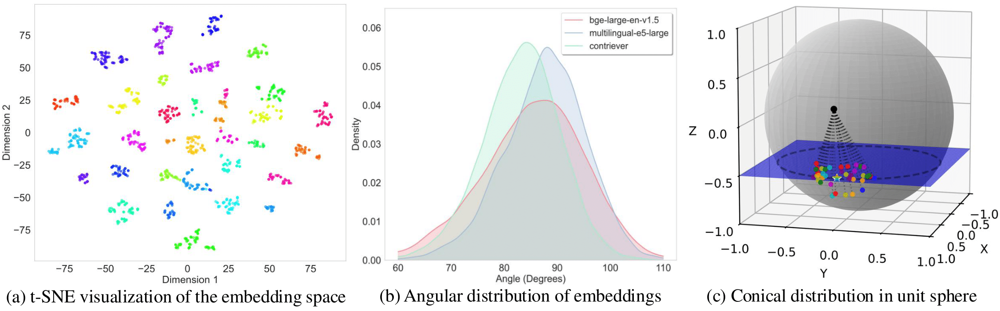
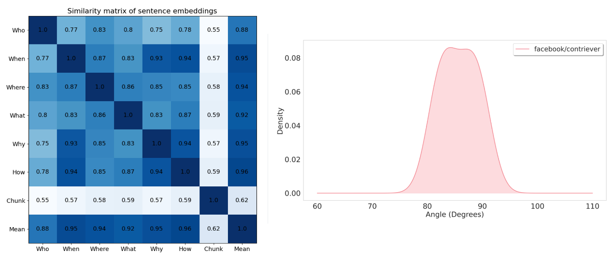
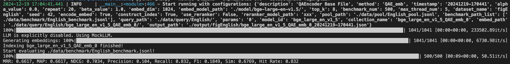
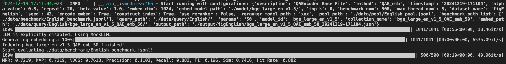
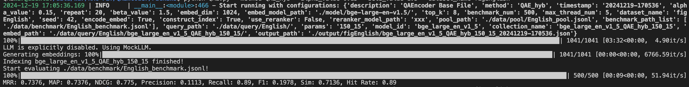

<h1 align="center">
    QAEncoder: Towards Aligned Representation Learning in Question Answering Systems
</h1>

<p align="center">
 <a href='https://arxiv.org/abs/2409.20434'></a> &nbsp;&nbsp;&nbsp;
 <a href='https://huggingface.co/datasets/zr-wang/FIGNEWS_generated_queries'></a>&nbsp;&nbsp;&nbsp;&nbsp;
 <a href="https://opensource.org/license/apache-2-0">
    
</a>
</p>

Official implementation of our [QAEncoder](https://arxiv.org/abs/2409.20434) method for more advanced QA systems. 

Affiliation: Peking University; Institute for Advanced Algorithms Research, Shanghai; Zhongguancun Academy.

## Introduction
Modern QA systems entail retrieval-augmented generation (RAG) for accurate and trustworthy responses. However, the inherent gap between user queries and relevant documents hinders precise matching. We introduce **QAEncoder**, a **training-free** approach to bridge this gap. Specifically, QAEncoder estimates the expectation of potential queries in the embedding space as a robust surrogate for the document embedding, and attaches document fingerprints to effectively distinguish these embeddings. 
Extensive experiments across diverse datasets, languages and embedding models confirmed QAEncoder's alignment capability, which offers **a simple yet effective solution with zero additional index storage, retrieval latency, training costs, or risk of hallucination**.

<table class="center">
    <tr>
        <td width=100% style="border: none"></td>
    </tr>
    <tr>
        <td width="100%" style="border: none; text-align: center; word-wrap: break-word">
              Illustration of QAEncoder's alignment process: Solid lines represent diversified query generation, while dashed lines indicate Monte Carlo estimation. The heatmap depicts the similarity scores among the embeddings of the different queries, the document, and the mean estimation.
      </td>
    </tr>
</table>

<table class="center">
    <tr>
        <td width=100% style="border: none"></td>
    </tr>
    <tr>
        <td width="100%" style="border: none; text-align: center; word-wrap: break-word">
      Architecture of  QAEncoder.   Left: Corpus documents are embedded using QAEncoder to obtain query-aligned representations for indexing.   User queries are encoded with a vanilla encoder and used to retrieve relevant documents.    
    Right: Internal mechanism of QAEncoder.
    QAEncoder  addresses the document-query gap by generating a diverse set of queries for each document to create semantically aligned embeddings.
    Additionally, document fingerprint strategies are employed to ensure document distinguishability.
      </td>
    </tr>
</table>
<table class="center">
    <tr>
        <td width=100% style="border: none"></td>
    </tr>
    <tr>
        <td width="100%" style="border: none; text-align: center; word-wrap: break-word">
Conical distribution hypothesis validation.
    The figure presents three visualizations supporting the conical distribution hypothesis: 
    (a) t-SNE visualization of queries derived from various documents in the embedding space, illustrating distinct clustering behavior.
    (b) Angular distribution of document and query embeddings, showing the distribution of angles between $ v_d = \mathcal{E}(d) - \mathbb{E}[\mathcal{E}(\mathcal{Q}(d))] $ and $ v_{q_i} = \mathcal{E}(q_i) - \mathbb{E}[\mathcal{E}(\mathcal{Q}(d))] $. 
    The angles form a bell curve just below 90°, supporting that $ v_d $ is approximately orthogonal to each $ v_{q_i}$ and serves as the normal vector.
    (c) 3D visualization illustrating the conical distribution of the document (black point) and query (colored points) embeddings  within a unit sphere. 
    The star indicates the queries' cluster center.
      </td>
    </tr>
</table>

## Quick Start

Set up the environment and run the demo script:

```bash
git clone https://github.com/IAAR-Shanghai/QAEncoder.git
cd QAEncoder

conda create -n QAE python=3.10
conda activate QAE

pip install -r requirements-demo.txt
python demo.py # Network is also required
```

Results should be like:



Change the embedding models, languages, documents and potential queries for verification of our hypothesis.

## Reproduction on FIGNEWS
We currently provide the core datasets and codes to reproduce results on FIGNEWS. The instruction is as follows:

```bash
cd FIGNEWS
pip install -r requirements-fignews.txt
pip uninstall llama-index-core
pip install llama-index-core==0.11.1 # reinstall to avoid subtle bugs


mkdir model output; unzip data.zip # setup datasets
python download_model.py # Download bge-large-en-v1.5 model for alignment
python QAE.py --method QAE_emb --alpha_value 0.0 --dataset_name figEnglish
python QAE.py --method QAE_emb --alpha_value 0.5 --dataset_name figEnglish
python QAE.py --method QAE_hyb --alpha_value 0.15 --beta_value 1.5 --dataset_name figEnglish
```

The results should be like:
> python QAE.py --method QAE_emb --alpha_value 0.0 --dataset_name figEnglish



> python QAE.py --method QAE_emb --alpha_value 0.5 --dataset_name figEnglish



> python QAE.py --method QAE_hyb --alpha_value 0.15 --beta_value 1.5 --dataset_name figEnglish



## Query Generation

For fast query generation, these online interfaces are recommend.

- https://huggingface.co/Qwen/Qwen2.5-0.5B-Instruct
- https://modelscope.cn/studios/qwen/Qwen2.5/

The following standard prompt is extracted from Llamaindex workflow, see the [blog](https://www.llamaindex.ai/blog/boosting-rag-picking-the-best-embedding-reranker-models-42d079022e83) or [docs](https://docs.llamaindex.ai/en/stable/examples/low_level/evaluation/).

```
Context information is below.

---------------------
{context_str}
---------------------

Given the context information and not prior knowledge.
generate only questions based on the below query.

You are a Professor. Your task is to setup {num_questions_per_chunk} questions for an upcoming quiz/examination. The questions should be diverse in nature across the document. The questions should not contain options, not start with Q1/ Q2. Restrict the questions to the context information provided.

```

A simpler prompt can be:

```
Context information is below.

-----------------
{context_str}
-----------------

You are an expert in text comprehension and question formulation, tasked with generating {num_questions_per_chunk} high-quality questions, based solely on the context.
```

<!-- ## 🚩 New Updates  -->
<!-- **⭐⭐⭐New Features⭐⭐⭐** -->

## TODO
This work is currently under review and code refactoring. We plan to fully open-source our project in order.

* [x] Release Demo
* [x] Release QAEncoder core codes and datasets
* [ ] Release QAEncoder codes compatible with Llamaindex and Langchain
* [ ] Release QAEncoder++, our future works


## 📖 BibTeX

```
@article{wang2024qaencoder,
    title={QAEncoder: Towards Aligned Representation Learning in Question Answering Systems}, 
    author={Wang, Zhengren and Yu, Qinhan and Wei, Shida and Li, Zhiyu and Xiong, Feiyu and Wang, Xiaoxing and Niu, Simin and Liang, Hao and Zhang, Wentao}
    journal={arXiv preprint arXiv:2409.20434},
    year={2024}
}
```
